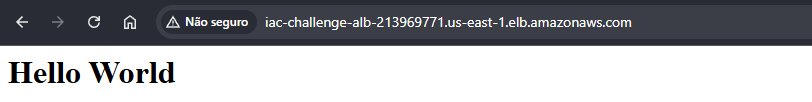
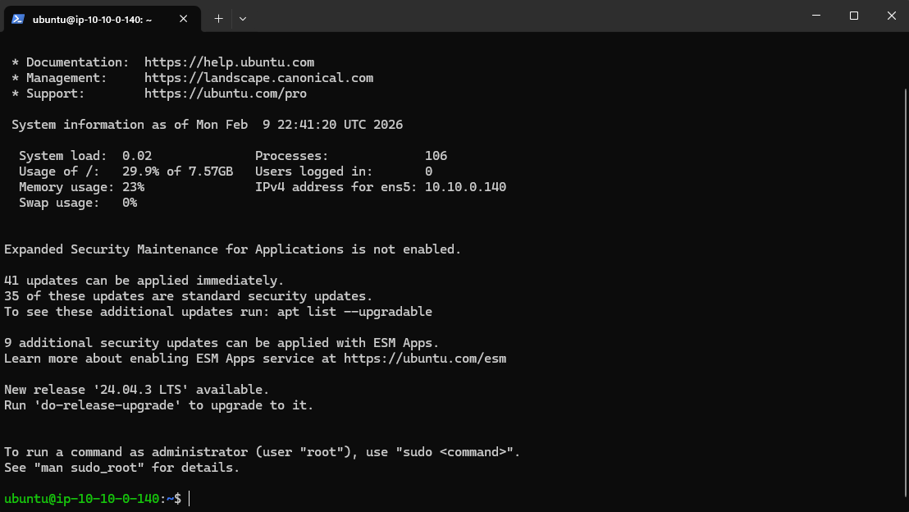
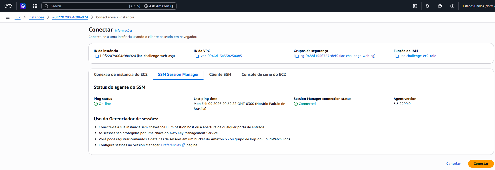
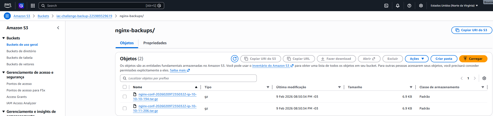
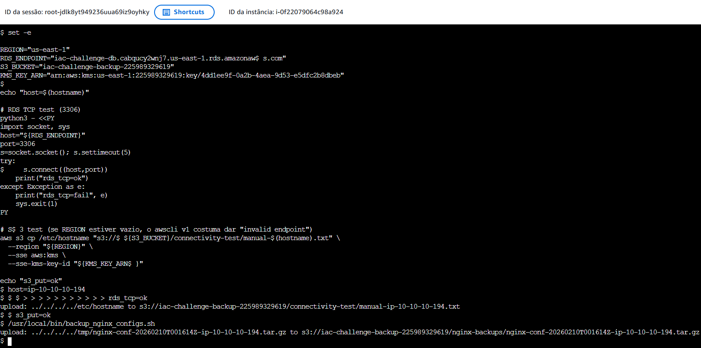
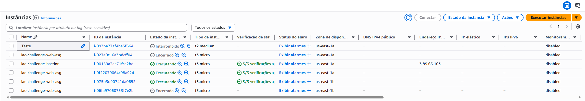
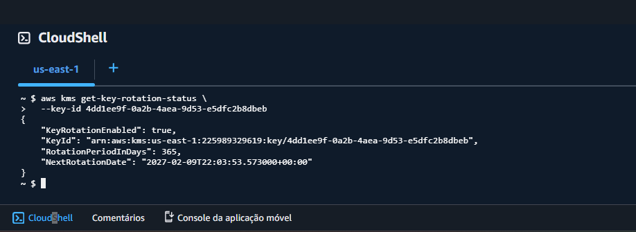
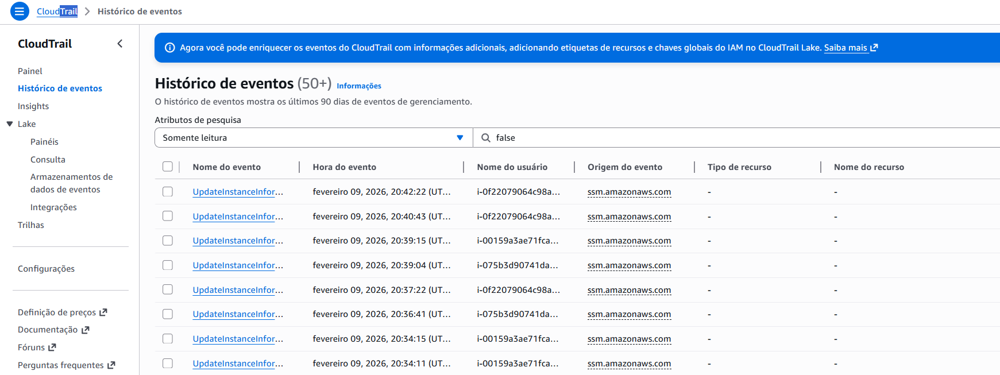

# Desafio 2 - UOL (Terraform na AWS)

Infraestrutura como código (Terraform) para subir um ambiente com:

- ALB público (HTTP/80)
- ASG de instâncias web em subnets privadas (Nginx)
- Bastion host em subnet pública (SSH restrito ao seu IP)
- RDS (privado) em subnets de banco
- S3 para backups com SSE-KMS e acesso de escrita restrito via VPC Endpoint (Gateway)
- CloudTrail e alarmes básicos no CloudWatch
- SSM habilitado nas instâncias (Session Manager)

Todo o código Terraform fica em `Terraform/`.

## Arquitetura

Rede (valores default em `Terraform/variables.tf`):

- Região: `us-east-1` (variável `region`)
- VPC: `10.10.0.0/16`
- Subnets públicas (2 AZs): `10.10.0.0/24`, `10.10.1.0/24`
- Subnets privadas web (2 AZs): `10.10.10.0/24`, `10.10.11.0/24`
- Subnets privadas db (2 AZs): `10.10.20.0/24`, `10.10.21.0/24`
- NAT Gateway para egress das subnets privadas (updates/SSM/etc)
- S3 Gateway VPC Endpoint associado à route table privada

Visão lógica:

```text
Internet
  |
  v
ALB (subnets públicas)  --->  Web ASG (subnets privadas web)  --->  RDS (subnets privadas db)
                 ^
                 |
           SSH (my_ip/32)
                 |
            Bastion (subnet pública)

Web ASG  --->  S3 Backup Bucket (SSE-KMS, PutObject somente via VPCE)
CloudTrail  --->  S3 CloudTrail Bucket
```

## Pré-requisitos

- Conta AWS com permissões para criar: VPC/EC2/ALB/ASG/RDS/IAM/KMS/S3/CloudWatch/CloudTrail/SSM.
- Terraform >= 1.2 (recomendado: 1.14.x).
- AWS CLI v2.
- (Windows) OpenSSH (`ssh`) para acessar o bastion.
- (Opcional) Session Manager Plugin para `aws ssm start-session`.

Notas importantes:

- NÃO commitar arquivos sensíveis: `*.tfstate`, `*.pem`, `tfplan` (já estão no `.gitignore`).
- O Terraform gera a chave SSH (RSA 4096) e salva localmente em `Terraform/bastion.pem` (se o arquivo ainda não existir) durante o `terraform apply`.
- Importante: mudar `project_name` após o primeiro `apply` força recriação de vários recursos (inclui RDS e buckets). Mantenha o mesmo valor entre applies.

## Reprodutibilidade (passo a passo)

1. Configure suas credenciais AWS (ex.: `aws configure`, SSO, ou variáveis de ambiente do AWS CLI).
2. Entre na pasta do Terraform:

```powershell
cd .\Terraform
```

3. (Opcional) Ajuste variáveis (ex.: `project_name`, `region`, `my_ip`) em `variables.tf` ou via `-var`.
4. Rode:

```powershell
terraform init
terraform fmt -recursive
terraform validate
terraform apply
```

5. Veja os outputs principais:

```powershell
terraform output
terraform output -raw alb_dns_name
terraform output -raw bastion_public_ip
terraform output -raw rds_endpoint
terraform output -raw s3_backup_bucket
```

### Variáveis principais

- `project_name` (default: `iac-desafio`): prefixo de nomes/tags.
- `region` (default: `us-east-1`).
- `my_ip` (default: `null`): CIDR liberado no SSH do bastion. Se `null`, o Terraform detecta seu IP via `https://api.ipify.org` e usa `/32`.

Exemplo (forçar seu IP manualmente):

```powershell
terraform apply -var "my_ip=203.0.113.10/32"
```

## Como acessar (Bastion -> Web)

Os exemplos abaixo assumem que você está em `.\Terraform`.

### Acessar a aplicação (via ALB)

```powershell
$Alb = terraform output -raw alb_dns_name
curl.exe -s http://$Alb
```

Resposta esperada (exemplo): `Hello World`



### Acessar o bastion (SSH)

```powershell
$BastionIp = terraform output -raw bastion_public_ip
ssh -i .\bastion.pem -o IdentitiesOnly=yes ubuntu@$BastionIp
```



### Descobrir as instâncias web (IP privado)

Entre em EC2 > Instâncias > Selecione o recurso desejado e veja seu IP Privado

### Entrar em uma instância web usando o bastion como jump host

```powershell
$BastionIp = terraform output -raw bastion_public_ip
ssh -i .\bastion.pem -o IdentitiesOnly=yes -J ubuntu@$BastionIp ubuntu@10.10.10.194
```

Observações:

- O IP `10.10.x.x` é privado. Do seu PC você não consegue `curl` nele diretamente.
- A partir do bastion, HTTP/80 nas instâncias web é permitido apenas para teste (requisito do desafio). De fora, use o ALB para acessar a aplicação.

### (Alternativa) Acesso via SSM (sem SSH)

- Console: `AWS Systems Manager -> Session Manager -> Start session` e selecione a instância.
- CLI (requer Session Manager Plugin):

```powershell
aws ssm start-session --target i-xxxxxxxxxxxxxxxxx --region us-east-1
```
ou, entre em EC2> Selecione a instância > conectar com SSM, conforme print abaixo:



### Teste HTTP interno (curl via bastion)

Dentro do bastion:

```bash
curl -s http://{IP_Privado_EC2}
```


## Backup (S3 via VPCE + KMS)

Nas instâncias web existe:

- Script: `/usr/local/bin/backup_nginx_configs.sh`
- Cron diário: `0 2 * * * root /usr/local/bin/backup_nginx_configs.sh`

Rodar manualmente em uma web instance:

```bash
sudo -n /usr/local/bin/backup_nginx_configs.sh
```



Verificar no bucket (na web instance):

```bash
BUCKET="<cole o output s3_backup_bucket aqui>"
aws s3 ls "s3://$BUCKET/nginx-backups/" --region us-east-1
```

Teste (evidência) de que o bucket exige VPCE:

- Tente fazer `PutObject` do seu PC/CloudShell para o bucket. Deve falhar com `AccessDenied` (por design).

## Testes

Esta seção é focada em diversos testes para válidar a segurança dos recursos.



### 1) Teste de acesso HTTP público (ALB)

No seu PC (PowerShell), dentro de `.\Terraform`:

```powershell
$Alb = terraform output -raw alb_dns_name
curl.exe -s -I http://$Alb
curl.exe -s http://$Alb
```

### 2) Teste de acesso HTTP interno (Bastion -> Instância)

No seu PC (PowerShell), dentro de `.\Terraform`:

```powershell
$BastionIp = terraform output -raw bastion_public_ip
ssh -i .\bastion.pem -o IdentitiesOnly=yes ubuntu@$BastionIp "curl -s http://10.10.10.194"
```

### 3) Teste de conectividade com o RDS (TCP)

Importante: rode este teste **dentro de uma instância web** (via SSM ou SSH via bastion). O Security Group do RDS aceita tráfego apenas do SG das instâncias web.

Na instância web:

```bash
RDS_ENDPOINT="<cole o output rds_endpoint aqui>"
RDS_PORT=3306 # MySQL (se usar Postgres: 5432)

python3 - <<'PY'
import os, socket, sys
host = os.environ["RDS_ENDPOINT"]
port = int(os.environ.get("RDS_PORT", "3306"))
s = socket.socket()
s.settimeout(5)
try:
  s.connect((host, port))
  print("rds_tcp=ok")
except Exception as e:
  print("rds_tcp=fail", e)
  sys.exit(1)
PY
```

### 4) Teste do backup (S3 via VPCE + KMS)

Na instância web:

```bash
sudo -n /usr/local/bin/backup_nginx_configs.sh
```

E valide se subiu no bucket (na instância web):

```bash
BUCKET="<cole o output s3_backup_bucket aqui>"
aws s3 ls "s3://$BUCKET/nginx-backups/" --region us-east-1 | tail -n 5
```


### 5) HA - Alta redundância

Entre em EC2 > Instâncias e tente desligar 1 ou mais Instâncias. Depois de cerca de 3 minutos, deverá surgir 1 ou mais para  substituí-las.



### 6) Chave rotativa

Para confirmar se a chave KMS está rotacionando, entre no CloudShell e escreva:

```bash
aws kms get-key-rotation-status \
  --key-id <ID>
```



## Como destruir o ambiente

1. Esvazie os buckets (porque `force_destroy = false`):

```powershell
$BackupBucket = terraform output -raw s3_backup_bucket
$CloudTrailBucket = terraform output -raw cloudtrail_bucket

aws s3 rm "s3://$BackupBucket" --recursive --region us-east-1
aws s3 rm "s3://$CloudTrailBucket" --recursive --region us-east-1
```

2. Execute o destroy:

```powershell
terraform destroy
```

Observação: KMS Keys e Secrets Manager podem ficar em estado "scheduled for deletion" por alguns dias (comportamento padrão dos serviços).

## Decisões de segurança

- Subnets privadas para web e banco (sem IP público).
- Bastion: SSH liberado somente para `my_ip` (ou IP autodetectado).
- Web: HTTP/80 permitido somente a partir do Security Group do ALB e do bastion (teste interno); SSH/22 permitido somente a partir do bastion.
- RDS: acesso liberado somente a partir do Security Group das instâncias web.
- S3 backup:
  - Block Public Access habilitado.
  - SSE-KMS com CMK dedicada e rotação habilitada.
  - Bucket policy nega `PutObject` fora do VPCE e nega tráfego sem TLS (`aws:SecureTransport=false`).

- CloudTrail habilitado gravando em bucket dedicado.
  
- Endurecimento básico nas web instances: `server_tokens off`, headers de segurança, `auditd`.
- IAM nas instâncias:
  - `AmazonSSMManagedInstanceCore` (SSM)
  - `CloudWatchAgentServerPolicy` (logs)
  - Policy limitada para `s3:PutObject` no bucket de backup e uso da CMK.

## Assunções (premissas)

- Ambiente de avaliação/estudo (custos: NAT Gateway, ALB e RDS geram cobrança enquanto ativos).
- Região default `us-east-1` (ajustável via `region`).
- SO das instâncias: Ubuntu 22.04 LTS.
- O state do Terraform fica local (na máquina). Para time/ambiente real, recomenda-se backend remoto (S3 + DynamoDB).

## CI/CD (GitHub Actions)

Workflows em `.github/workflows/`:

- `terraform-ci.yml`:
  - `terraform fmt -check`, `terraform validate`
  - Scans: `tfsec`, `checkov`, `gitleaks`, `trufflehog`
  - (Opcional) `terraform plan` em PR via OIDC se `AWS_ROLE_ARN` estiver configurado
- `terraform-cd.yml` (opcional):
  - `workflow_dispatch` manual com gate via environment `production`
  - OIDC (sem chaves estáticas)
  - Guardrail: `apply` exige backend remoto `backend "s3"` (para não perder o state no runner)
