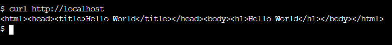

# Desafio 2 - UOL (Terraform na AWS)

Infraestrutura como codigo (Terraform) para subir um ambiente com:

- ALB publico (HTTP/80)
- ASG de web instances em subnets privadas (Nginx)
- Bastion host em subnet publica (SSH restrito ao seu IP)
- RDS (privado) em subnets de banco
- S3 para backups com SSE-KMS e acesso de escrita restrito via VPC Endpoint (Gateway)
- CloudTrail e alarmes basicos no CloudWatch
- SSM habilitado nas instancias (Session Manager)

Todo o codigo Terraform fica em `Terraform/`.

## Arquitetura

Rede (valores default em `Terraform/variables.tf`):

- Region: `us-east-1` (variavel `region`)
- VPC: `10.10.0.0/16`
- Subnets publicas (2 AZs): `10.10.0.0/24`, `10.10.1.0/24`
- Subnets privadas web (2 AZs): `10.10.10.0/24`, `10.10.11.0/24`
- Subnets privadas db (2 AZs): `10.10.20.0/24`, `10.10.21.0/24`
- NAT Gateway para egress das subnets privadas (updates/SSM/etc)
- S3 Gateway VPC Endpoint associado a route table privada

Visao logica:

```text
Internet
  |
  v
ALB (public subnets)  --->  Web ASG (private-web subnets)  --->  RDS (private-db subnets)
                 ^
                 |
           SSH (my_ip/32)
                 |
            Bastion (public subnet)

Web ASG  --->  S3 Backup Bucket (SSE-KMS, PutObject somente via VPCE)
CloudTrail  --->  S3 CloudTrail Bucket
```

## Pre-requisitos

- Conta AWS com permissoes para criar: VPC/EC2/ALB/ASG/RDS/IAM/KMS/S3/CloudWatch/CloudTrail/SSM.
- Terraform >= 1.2 (recomendado: 1.14.x).
- AWS CLI v2.
- (Windows) OpenSSH (`ssh`) para acessar o bastion.
- (Opcional) Session Manager Plugin para `aws ssm start-session`.

Notas importantes:

- NAO commitar arquivos sensiveis: `*.tfstate`, `*.pem`, `tfplan` (ja estao no `.gitignore`).
- O Terraform gera a chave SSH (RSA 4096) e salva localmente em `Terraform/bastion.pem` (se o arquivo ainda nao existir) durante o `terraform apply`.

## Reprodutibilidade (passo a passo)

1. Configure credenciais AWS (ex.: `aws configure`, SSO, ou variaveis de ambiente do AWS CLI).
2. (Opcional) Ajuste variaveis (ex.: `project_name`, `region`, `my_ip`) em `Terraform/variables.tf` ou via `-var`.
3. Rode os comandos abaixo a partir da raiz do repo:

```powershell
terraform -chdir=Terraform init
terraform -chdir=Terraform fmt -recursive
terraform -chdir=Terraform validate
terraform -chdir=Terraform apply
```

4. Pegue os outputs principais:

```powershell
terraform -chdir=Terraform output
terraform -chdir=Terraform output -raw alb_dns_name
terraform -chdir=Terraform output -raw bastion_public_ip
terraform -chdir=Terraform output -raw rds_endpoint
terraform -chdir=Terraform output -raw s3_backup_bucket
```

### Variaveis principais

- `project_name` (default: `iac-desafio`): prefixo de nomes/tags.
- `region` (default: `us-east-1`).
- `my_ip` (default: `null`): CIDR liberado no SSH do bastion. Se `null`, o Terraform detecta seu IP via `https://api.ipify.org` e usa `/32`.
- Importante: mudar `project_name` apos o primeiro `apply` forca recriacao de varios recursos (inclui RDS e buckets). Mantenha o mesmo valor entre applies.

Exemplo forcar seu IP manualmente:

```powershell
terraform -chdir=Terraform apply -var "my_ip=203.0.113.10/32"
```

## Como acessar (Bastion -> Web)

### Acessar a aplicacao (via ALB)

```powershell
$Alb = terraform -chdir=Terraform output -raw alb_dns_name
curl.exe -s http://$Alb
```

Resposta esperada (exemplo): `Hello World`

### Acessar o bastion (SSH)

```powershell
$BastionIp = terraform -chdir=Terraform output -raw bastion_public_ip
ssh -i .\\Terraform\\bastion.pem -o IdentitiesOnly=yes ubuntu@$BastionIp
```

### Descobrir as instancias web (IP privado)

```powershell
$Asg = terraform -chdir=Terraform output -raw web_asg_name
$Ids = (aws autoscaling describe-auto-scaling-groups --auto-scaling-group-names $Asg --query "AutoScalingGroups[0].Instances[].InstanceId" --output text)
aws ec2 describe-instances --instance-ids $Ids --query "Reservations[].Instances[].{Id:InstanceId,PrivateIP:PrivateIpAddress,AZ:Placement.AvailabilityZone}" --output table
```

### Entrar em uma instancia web usando o bastion como jump host (ProxyJump)

```powershell
$BastionIp = terraform -chdir=Terraform output -raw bastion_public_ip
ssh -i .\\Terraform\\bastion.pem -o IdentitiesOnly=yes -J ubuntu@$BastionIp ubuntu@10.10.10.194
```

Observacoes:

- O IP `10.10.x.x` e privado. Do seu PC voce nao consegue `curl` nele diretamente.
- A partir do bastion, HTTP/80 nas instancias web e permitido apenas para teste (requisito do desafio). De fora, use o ALB para acessar a aplicacao.

### (Alternativa) Acesso via SSM (sem SSH)

- Console: `AWS Systems Manager -> Session Manager -> Start session` e selecione a instancia.
- CLI (requer Session Manager Plugin):

```powershell
aws ssm start-session --target i-xxxxxxxxxxxxxxxxx --region us-east-1
```

### Teste HTTP interno (curl via bastion)

Dentro do bastion:

```bash
curl -s http://10.10.10.194
```

## Backup (S3 via VPCE + KMS)

Nas instancias web existe:

- Script: `/usr/local/bin/backup_nginx_configs.sh`
- Cron diario: `0 2 * * * root /usr/local/bin/backup_nginx_configs.sh`

Rodar manualmente em uma web instance:

```bash
sudo -n /usr/local/bin/backup_nginx_configs.sh
```

Verificar no bucket (na web instance):

```bash
BUCKET="<cole o output s3_backup_bucket aqui>"
aws s3 ls "s3://$BUCKET/nginx-backups/" --region us-east-1
```

Teste (evidencia) de que o bucket exige VPCE:

- Tente fazer `PutObject` do seu PC/CloudShell para o bucket. Deve falhar com `AccessDenied` (por design).

## Testes basicos

### 1) Health do ALB (HTTP)

```powershell
$Alb = terraform -chdir=Terraform output -raw alb_dns_name
curl.exe -s -I http://$Alb
```

### 2) Conectividade TCP com o RDS (a partir da web instance)

Importante: o Security Group do RDS permite conexao SOMENTE do SG das instancias web. Entao rode este teste na web instance (SSM ou SSH via bastion).

```bash
RDS_ENDPOINT="<cole o output rds_endpoint aqui>"
RDS_PORT=3306 # mysql (se usar postgres: 5432)

python3 - <<'PY'
import os, socket, sys
host = os.environ["RDS_ENDPOINT"]
port = int(os.environ.get("RDS_PORT", "3306"))
s = socket.socket()
s.settimeout(5)
try:
  s.connect((host, port))
  print("rds_tcp=ok")
except Exception as e:
  print("rds_tcp=fail", e)
  sys.exit(1)
PY
```

Se retornar `Connection refused`, verifique:

- se o `db_engine` e MySQL (porta 3306) ou Postgres (porta 5432)
- se o RDS esta `available`
- se o teste foi executado de dentro da web instance (nao do bastion/CloudShell)

### 3) Backup (PutObject) e listagem no S3 (a partir da web instance)

```bash
sudo -n /usr/local/bin/backup_nginx_configs.sh
aws s3 ls "s3://$BUCKET/nginx-backups/" --region us-east-1
```

## Como destruir o ambiente

1. Esvazie os buckets (porque `force_destroy = false`):

```powershell
$BackupBucket = terraform -chdir=Terraform output -raw s3_backup_bucket
$CloudTrailBucket = terraform -chdir=Terraform output -raw cloudtrail_bucket

aws s3 rm "s3://$BackupBucket" --recursive --region us-east-1
aws s3 rm "s3://$CloudTrailBucket" --recursive --region us-east-1
```

2. Execute o destroy:

```powershell
terraform -chdir=Terraform destroy
```

Observacao: KMS Keys e Secrets Manager podem ficar em estado "scheduled for deletion" por alguns dias (comportamento padrao dos servicos).

## Decisoes de seguranca

- Subnets privadas para web e banco (sem IP publico).
- Bastion: SSH liberado somente para `my_ip` (ou IP autodetectado).
- Web: HTTP/80 permitido SOMENTE a partir do Security Group do ALB; SSH/22 permitido SOMENTE a partir do bastion.
- RDS: acesso liberado SOMENTE a partir do Security Group das instancias web.
- S3 backup:
  - Block Public Access habilitado.
  - SSE-KMS com CMK dedicada e rotacao habilitada.
  - Bucket policy nega `PutObject` fora do VPCE e nega trafego sem TLS (`aws:SecureTransport=false`).
- CloudTrail habilitado gravando em bucket dedicado.
- Endurecimento basico nas web instances: `server_tokens off`, headers de seguranca, `auditd`.
- IAM nas instancias:
  - `AmazonSSMManagedInstanceCore` (SSM)
  - `CloudWatchAgentServerPolicy` (logs)
  - policy limitada para `s3:PutObject` no bucket de backup e uso da CMK.

## Assuncoes (premissas)

- Ambiente de avaliacao/estudo (custos: NAT Gateway, ALB e RDS geram cobranca enquanto ativos).
- Region default `us-east-1` (ajustavel via `region`).
- SO das instancias: Ubuntu 22.04 LTS.
- O state do Terraform fica local (na maquina). Para time/ambiente real, recomenda-se backend remoto (S3 + DynamoDB).

## CI/CD (GitHub Actions)

Workflows em `.github/workflows/`:

- `terraform-ci.yml`:
  - `terraform fmt -check`, `terraform validate`
  - scans: `tfsec`, `checkov`, `gitleaks`, `trufflehog`
  - (Opcional) `terraform plan` em PR via OIDC se `AWS_ROLE_ARN` estiver configurado
- `terraform-cd.yml` (opcional):
  - `workflow_dispatch` manual com gate via environment `production`
  - OIDC (sem chaves estaticas)
  - guardrail: `apply` exige backend remoto `backend \"s3\"` (para nao perder state no runner)

## Evidencias (imagens)




